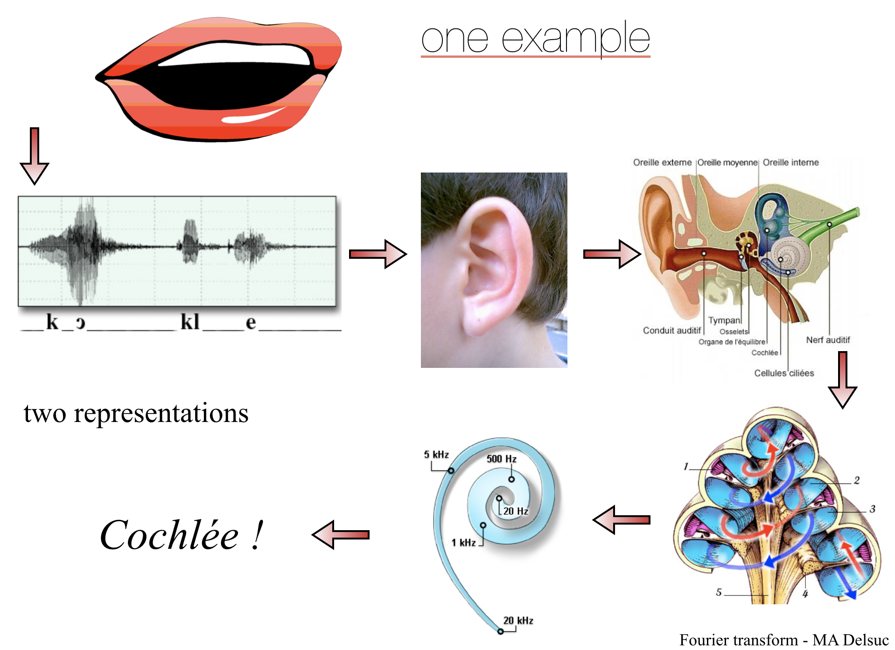

<!-- #region -->
# The Fourier Transform - the basic aspects
### 2nd-AUS-FTICR
*Marc-André Delsuc - Prague 26-30 Sept 2021*


This work is licensed under [CC BY-SA 4.0](https://creativecommons.org/licenses/by-sa/4.0/)
<!-- #endregion -->

a developed content of this part can be found on [github.com/delsuc](https://github.com/delsuc/Fourier_Transform/blob/master/Definition_Properties.ipynb)


# Fourier Transform Definition

Fourier Transform is defined on continuous functions:

for a function $f(x)$  $x \in \mathbb{R} \rightarrow f(x) \in \mathbb{C}$

the **Fourier transform** of $f$ is another function $F$ 

$F(X)$  $X \in \mathbb{R} \rightarrow F(X) \in \mathbb{C}$

$$
f \xrightarrow{FT} F
$$

$$
F(X) = \int_{-\infty}^{+\infty} f(x) e^{-2i \pi x X} dx
$$


# ❓️ 


# 😭 $\quad$or$\quad$ 🤣

<!-- #region -->
# Spectral Analysis
### Time vs Frequency

One example of the relation between time and frequencies - as observed in nature




- $f(t)$  pressure wave / function of time.
- ear-drum vibrate with the same pattern $\rightarrow$ standing wave in the cochlea
- pressure nodesalong the cochlea spiral, *position F( frequency )* 

    - $\Rightarrow$ a mechanical Fourier transform !

phonetic pattern is somehow the time-dependent **Fourier transform** of the inital pressure wave.

They both carry somehow the same information, but in a very different way.
<!-- #endregion -->

<!-- #region -->
# Fourier Transform Definition (2)

So, using $x \rightarrow t$ as time

and $X \rightarrow \omega$ as frequency

$$
\int_{-\infty}^{+\infty} f(t) e^{-2i \pi t \omega} dx
$$

is just a way to **weigh** the presence of a given frequency $\omega : e^{-2i \pi \omega t}$ in $f(t)$


$x$ and $X$ represent two different reciproqual quantitites, and can be found in many domains

|$x$   |$X$   |
| ----- | ----- |
| $t$ : time (sec) | $\omega$ : frequency (Hz) |
| $x$ : space (Å) | $k$ : spacial frequency (Å$^{-1}$) |
| $\lambda$ : wavelength ($cm$) | $k$ : spacial frequency ($cm^{-1}$) |
| etc... | |

<!-- #endregion -->

- time / freq
    - spectral analysis
    - point of view
    - instantaneity / global property
    - time varying / freq varying / FTICR
- fundamental equation
    - basic
    - time / frequency domains
        - != point of views
    - complex numbers, Euler notation 
- basic properties
    - compaction theorem
    - perceval
    - $S_o  F_o$
- FT - DFT - FFT
    - analytic - numeric
    - DFT
    - nth root of 1
    - FFT
- DFT / FT differences
    - frequency bounded signal
    - Nyquist relation
    - filtering
    - $S_o  F_o$
    - $t_{max} \Delta F$ / $F_{max} \Delta t$ / $N$
- convolution
    - rapidly
    - periodisation / sampling - link with convolution
    - 

```python

```
